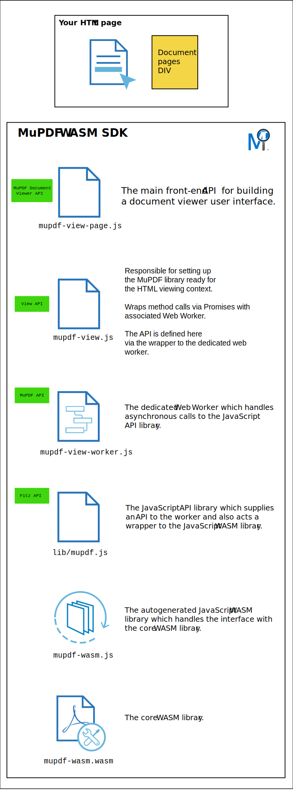

.. meta::
   :description: MuPDF WASM documentation
   :keywords: WASM, MuPDF

PDF Viewing
===============================

.. _pdf_viewing_the_document_area:

The Document Area
--------------------------

There should be a dedicated area in your :title:`DOM` dedicated to the rendering of any loaded PDF document pages.

This dedicated area should have any associated :title:`CSS` for the layout of that area defined to suit your requirements.

For example consider an :title:`HTML` element as follows:

.. code-block:: html

   

With associated :title:`CSS`:

.. code-block:: css

   #pages {
      margin: 0 auto;
   }

   #pages div.page {
      position:relative;
      background-color:white;
      margin:16px auto;
      box-shadow: 0px 4px 16px 0px rgba(0,0,0,0.2);
   }

This would create a dedicated document area with white drop-shadow pages with top and bottom margins for their spacing. These pages will not be visible until the document is rendered.

.. note::
   Later, when a document has loaded, this dedicated ``#pages div`` will append additional ``.page divs`` representing each page of your document. But we will come to that later.

:title:`JavaScript` setup
---------------------------------

There is a fair amount of :title:`JavaScript` knowledge required for your :title:`WASM` application and intermediate or advanced knowledge is recommended. :title:`JavaScript` beginners beware!

The :title:`JavaScript` dependencies and SDK file structure can be see here:

.. _mupdf-wasm-structure:

*Fig.1 : MuPDF WASM structure*

Your solution should mirror this structure with your main HTML file importing ``mupdf-view.js`` & ``mupdf-view-page.js`` directly:

.. code-block:: html

   
   

Depending on your application you will require UI controls for both file operations & document manipulation. Let's start with how to open a file and present the result to your webpage.

.. note::
   Coding samples & guides within this documentation will be using the user interface API as outlined in :ref:`The MuPDF DocumentViewer API<mupdfDocumentViewerAPI>`.

``MupdfDocumentViewer``
-------------------------

This class should be instantiated on your :title:`HTML` page as a variable. It acts as the interface to control your document.

.. code-block:: javascript

   

Opening a File
--------------------------

Once you have created a ``MupdfDocumentViewer`` instance then you are ready to open a file.

Consider the following in your DOM:

.. code-block:: html

   <input type="file" accept=".pdf,.xps,application/pdf" onchange="documentViewer.openFile(event.target.files[0])">

   
   
   

- When the user presses on the ``input`` element a dialog for file selection will appear.
- When a file has been chosen by the user (note: limited to PDF & XPS files only) then the :title:`JavaScript` ``documentViewer.openFile`` method will trigger with the ``File`` object passed in parameter and an editor mode of ``0`` (disabled).
- The ``MupdfDocumentViewer`` validates that the method's parameter is indeed of type ``File``, if it isn't then an error will be thrown.
- Assuming there is no error, the document will load & display in the dedicated ``#pages`` div (as explained in :ref:`The Document Area<pdf_viewing_the_document_area>`).

See the :ref:`MuPDF DocumentViewer API<mupdfDocumentViewerAPI>` for how to interact with the document and for further information.

..
   External links

.. _Using Promises: https://developer.mozilla.org/en-US/docs/Web/javascript/Guide/Using_promises

